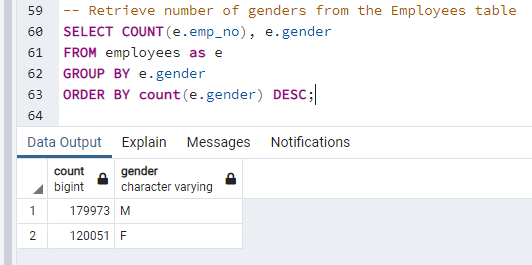
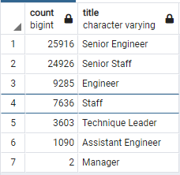
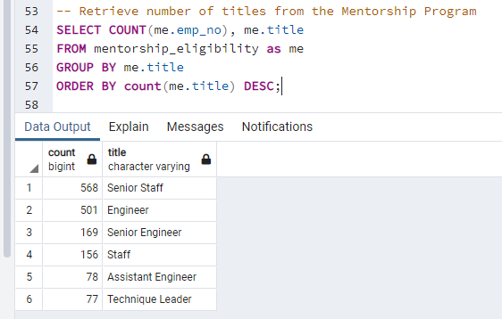
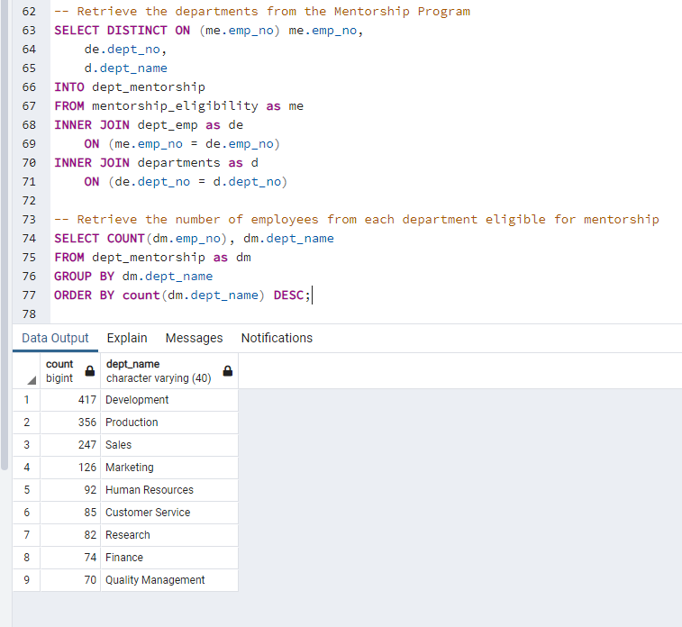
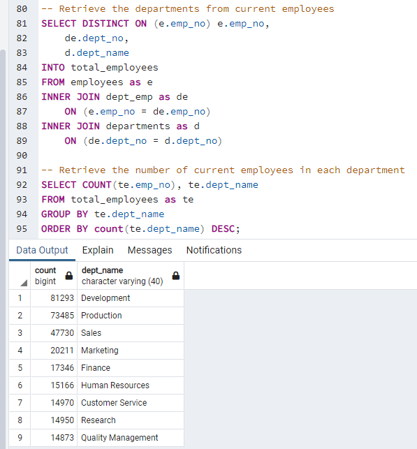

# Pewlett-Hackard-Analysis

For this part of the Challenge, you’ll write a report to help the manager prepare for the upcoming "silver tsunami."

The analysis should contain the following:

# Overview 
This analysis has been conducted to provide insight on staff who are retiring from Pwelett-Hackard. This analysis aided in creating a mentorship program to reduce the potential detrementous impact of having a large amount of employees who were born between January 1, 1952 and December 31, 1955, retire at the same time. A mentorship program for eligble employees who were born between January 1, 1965 and December 31, 1965, could help reduce the loss of employees.  

# Results
The following results have been uncovered:
- Out of all 300024 employees, 72,458 staff are retiring. This means 24.15% of the entire staff population will be retiring. 
- Staff  will be retiring from the following 7 job titles: Senior Engineer, Senior Staff, Engineer, Staff, Technique Leader, Assistant Engineer, and Manager
- The highest number of staff are leaving their positions as Senior Engineer and Senior Staff
- From the total amount of retiring staff (72,458), only 1549 are eligible for the mentorship program

### Total Amount of Employees based on Gender

### Breakdown of Retiring Staff based on Job Titles 

### Breakdown of Staff eligible for Mentorship Program

# Summary

## Potential Vacant Positions
Based on the analysis, 72,458 staff members are eligible for retirement. Over 72,450 positions across the company are at risk of becoming vacant once the 'silver tsunami' begins. 

## Qualified Mentors
Given the total amount of employees retiring, only 2.13% are eligible to become a mentor (1549 out of 72,458) and train existing staff. The highest amount of employees available are for the departments of Development and Production, with 417 and 356 staff eligible to become mentors, respectfully. 
### Breakdown of Staff eligible for the Mentorship program based on Departments

## Implications
As an example, the Development and Production department, respectfully have 81,293 and 73,485 employees each. This means that each eligible mentor in the Development department would need to teach almost 195 staff; and each eligible mentor in the Production department would need to teach almost 207 staff on average. It would be impossible for mentors to teach or train each staff member within the departments. There are therefore not enough qualified retirement-ready employees in each department to mentor the next generation, especially if some mentors would be working on a part-time basis. 
### Breakdown of Total Staff per Department

## Recommendation
Seeing as there are not enough qualifying mentors eligible to teach the entire population of employees within each department, I would recommend that Pewlett-Hackard use the resources of mentors and have them create a training plan where they will record their best practices, tips and tricks. These training programs could for example be pre-recorded videos where the mentors share their knowledge. These videos can then be used to be distributed amongst staff within each department. They could then also hold re-occuring Q&A sessions, where staff can ask questions and connect with mentors when needed.  
